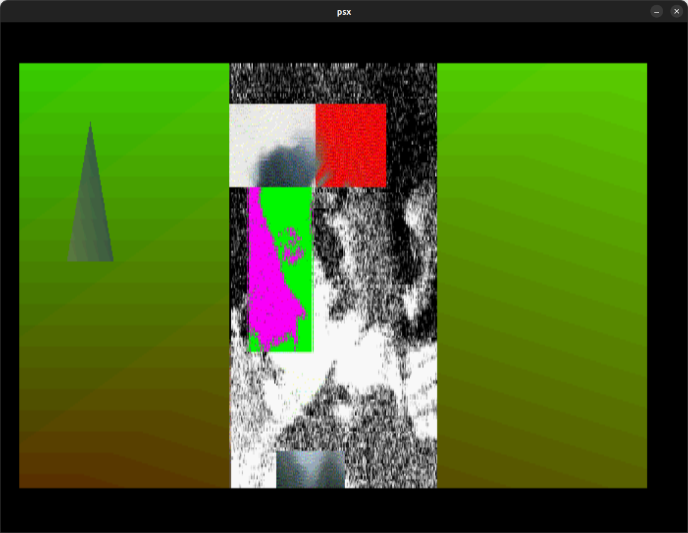
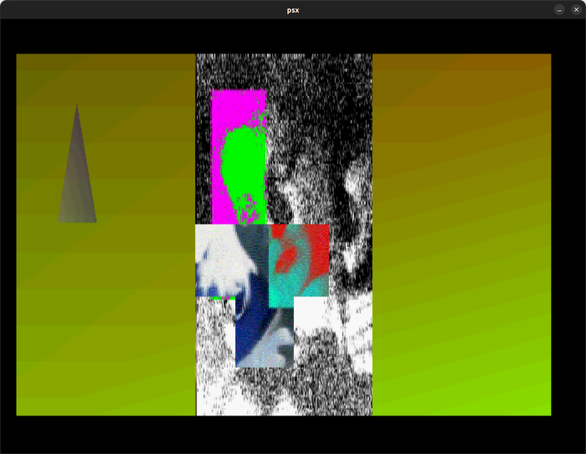

# Death (Sandman character) image demo

This is a little moving image demo I put together in around 1999 for the PSX, written in assembly, and using Yaroze library functions for graphics.

I'm still working out exactly what toolchain I used.

It was written on an Amiga, and transferred to my modded PSX (it had a blue power LED, and a rainbow ribbon cable fish-tail hanging out the back through the serial port)
 using a tool called `PSXControl` over a Skywalker serial cable / converter box I built (and still have).

Amazingly, this code compiles and runs in an emulator after the conversions, and being passed through [Yarexe](https://github.com/gwald/Yarexe).

I'm still trying to figure out why the load addresses don't seem correct, but it still works. The original EXE was meant to load to `0x80100000`, but the current
`cargo-psx` ld script hardcodes the standard `0x80010000` location. It feels like this should conflict with `libps.exe`

Initially I modified `psexe.ld` to use `0x80100000`, but it seemed like multiple messed up versions worked just as well, so I tried using the unmodified default... and that just worked too.

The biggest problem in the conversion and getting this to run was forgetting to add `.set noreorder` in the converted source.

It's possible the program _is_ overwriting part of the library. This code is small enough, and uses very little of the library that it might get away with overlapping some part of the library.
I'll figure it out later.

The other mystery to solve is why an original PSX EXE as compiled on the Amiga I had as a backup doesn't run as well as the new compiled version in the emulator.
This newly compiled version matches how I remember it running on the real hardware. The original EXE doesn't show the moving blocks correctly -- they just glitch.

## Build and run

Because this code requires the `libps.exe` Yaroze library to be loaded in memory, the standard `cargo build run` to compile and run in Mednafen _won't_ work.

To build the PSX EXE:

    cargo psx build

Then we need to create a standalone executable using [Yarexe](https://github.com/gwald/Yarexe):

    yarexe death.sio -v

which will generate a new (larger) PSX executable `psx.exe`. We can now run this in the emulator using:

    mednafen psx.exe

## Original files
`archive/` contains the original files as taken from my A1200.

* [Death_pic.asm](archive/Death_pic.asm) The original source code. It looks spASM _like_, but has extra symbols in front of hex and labels.
* death.tim The image used in the demo. It has 3 panels, I'm assuming it is some official painting of the character Death from the DC Vertigo Sandman comics that I cropped, tiled, and filtered, but I can't remember the original source, or exactly how much I modified it.
* [death_pic.s](archive/death_pic.s) I had to write a pre-compiler that took the .asm source, stripped out comments, and figured out label addresses and other symbols to get the code to compile using whatever MIPS assembler I had. It's possible that the style of ASM in the original is completely unique. I'm still trying to locate the scripts I used.
* [death_pic.script](archive/death_pic.script) This is the original transfer script for the separate data and exe files. It does the job of a Siocons `auto` file. Presumably part of `PSXControl`?

## Screenshots

There is no sound, there are two moving rectangle windows which display a different effect layer. The backgound changes colour with a glitchy gradient. It's pretty basic, but it was written in assembly by reverse engineering Yaroze library functions.

